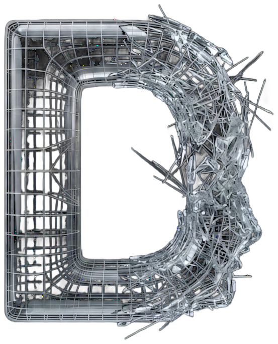
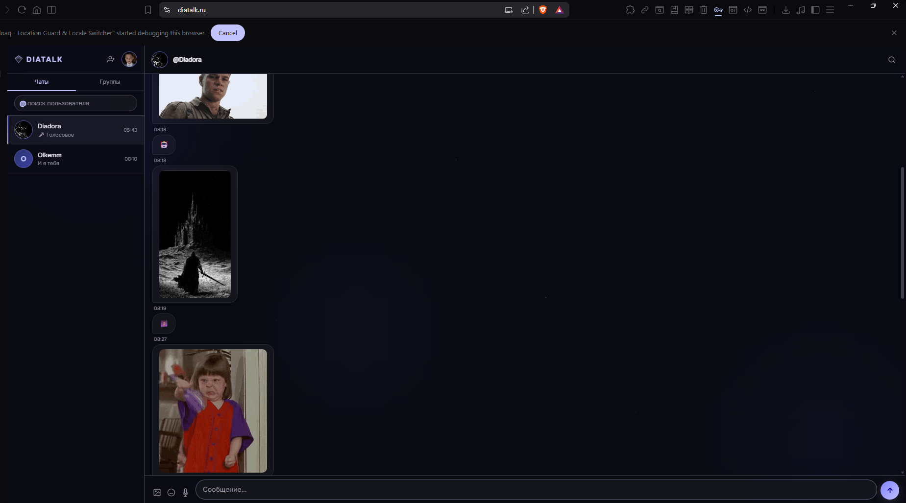

<div align="center">



# not DIA

**Secure real-time messenger**

A self-hosted messenger with end-to-end encryption mindset, real-time delivery,
and a PWA frontend that works everywhere.

`Python` `FastAPI` `WebSocket` `SQLAlchemy` `Web Push` `PWA`

🌐 **Live:** [diatalk.ru](https://diatalk.ru)

---

</div>

<br/>

## Overview

not DIA (Diatalk) is a full-stack messenger built from scratch — FastAPI backend with WebSocket real-time delivery, SQLAlchemy ORM, push notifications, and a pure HTML/CSS/JS frontend that installs as a PWA. No React, no frameworks, no dependencies you don't control.

Groups, reactions, voice messages, forwarding, multiple themes — everything a modern messenger needs, self-hosted and under your control.

<br/>

## Screenshots

<div align="center">

| Login | Chat |
|:---:|:---:|
|  |  |

</div>

<br/>

## Features

### Messaging
— **Real-time delivery** via WebSocket — instant message sync
— **Direct messages** and **group chats** with admin controls
— **Replies** — quote and respond to specific messages
— **Forwarding** — share messages between chats with original sender attribution
— **Message pinning** — pin important messages in any chat
— **Reactions** — emoji reactions on any message
— **Read receipts** — message read status tracking

### Media
— **Image sharing** with inline preview and lightbox
— **Video messages** with embedded player
— **Voice messages** — record and send audio directly
— **File attachments** — any file type with download link
— Automatic media type detection and preview rendering

### Notifications
— **Web Push notifications** (VAPID) — works even with browser closed
— Per-user subscription management
— Push preview: sender name + message excerpt

### Themes
— **4 built-in color themes**: Default (violet), Midnight (blue), Rose (pink), Forest (green)
— Full CSS variable system — every color adapts
— Animated background orbs match the active theme

### PWA
— **Installable** on desktop and mobile — add to home screen
— Offline-capable service worker
— Mobile-responsive layout — works on any screen size
— Native-like experience without an app store

<br/>

## Architecture

```
┌──────────────────────────────────────────────────┐
│  not DIA                                          │
│                                                    │
│  ┌────────────┐    WebSocket     ┌──────────────┐ │
│  │  Frontend   │ ◄─────────────► │   Backend     │ │
│  │  HTML/CSS/JS│    REST API     │   FastAPI     │ │
│  │  PWA        │ ◄─────────────► │   Python      │ │
│  └────────────┘                  └──────┬───────┘ │
│                                         │         │
│                              ┌──────────▼────────┐│
│                              │   SQLAlchemy ORM   ││
│                              │   SQLite / Postgres││
│                              └───────────────────┘│
│                                                    │
│  Web Push (VAPID)  ◄──  Background notifications   │
└──────────────────────────────────────────────────┘
```

<br/>

## Tech Stack

| Component | Technology |
|:---|:---|
| **Backend** | Python, FastAPI, Uvicorn |
| **Real-time** | WebSocket (native FastAPI) |
| **Database** | SQLAlchemy ORM, SQLite (dev) / PostgreSQL (prod) |
| **Notifications** | Web Push via pywebpush (VAPID) |
| **Frontend** | Vanilla HTML/CSS/JS — no framework |
| **Deployment** | Any VPS, Docker-ready |

<br/>

## Design

```
◇ 4 theme system          — violet, midnight blue, rose, forest green
◇ Animated orb backgrounds — subtle floating color spheres
◇ Glass morphism cards     — translucent message bubbles
◇ Zero-framework frontend  — pure CSS variables, no build step
◇ Mobile-first responsive  — works on any screen size
```

<br/>

---

<div align="center">

**not DIA** is part of the [not ecosystem](https://github.com/notevil076) — a collection of tools that replace what's broken with something that isn't.

[](https://github.com/notevil076)
[](https://t.me/notevil076)
[](https://diatalk.ru)

</div>
